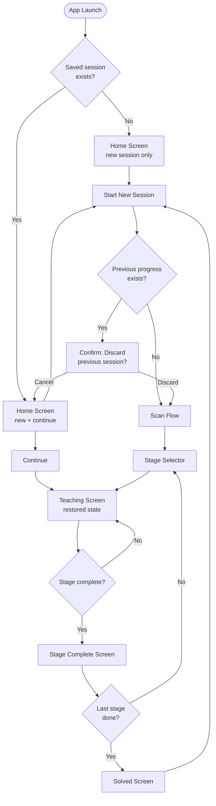
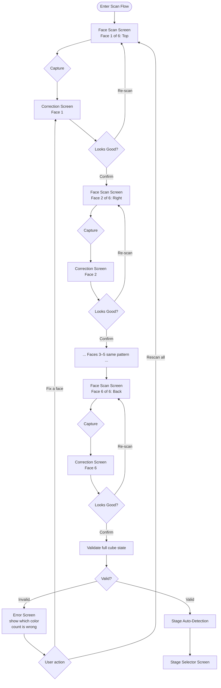
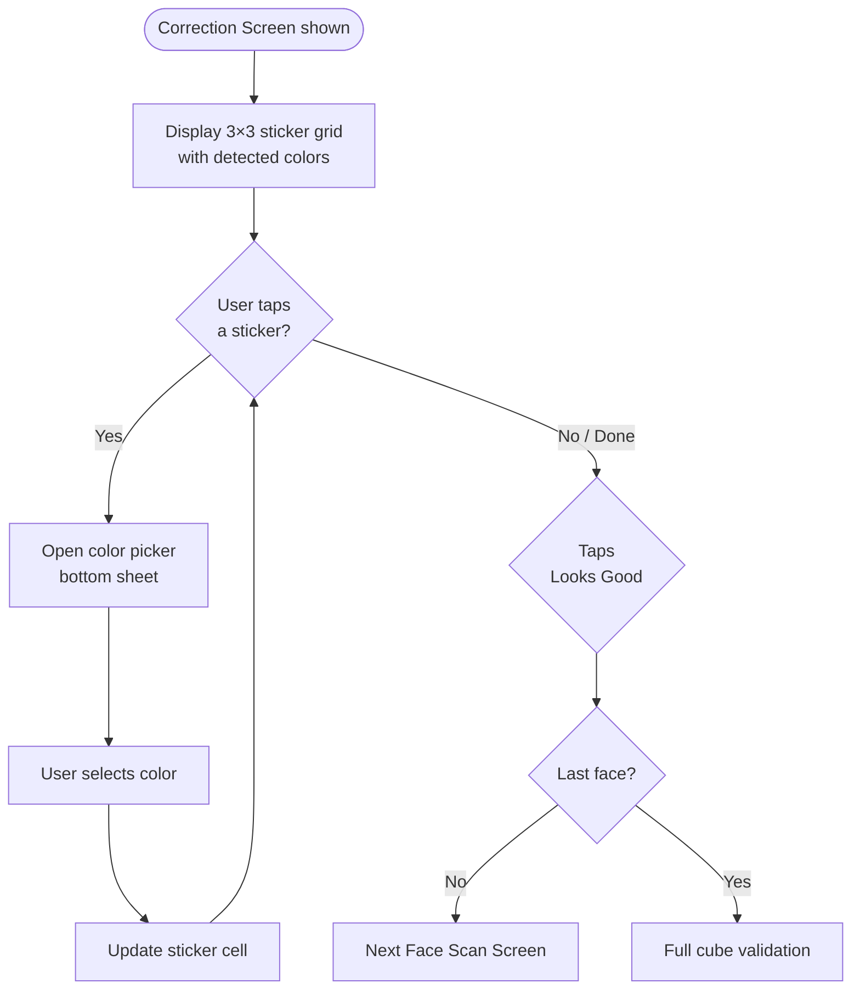
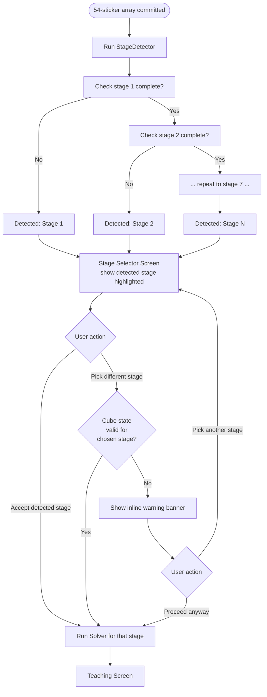
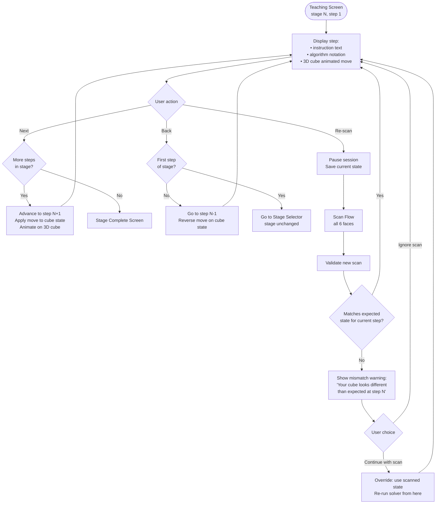
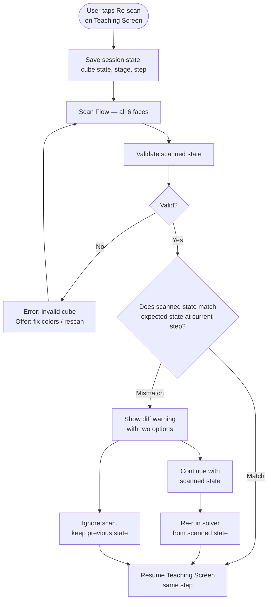

# 04 — App Flow
> Rubik's Cube Learning App · v1.0 · Last updated: 2026-10-02

---

## 1. Top-Level Flow



---

## 2. Scan Flow (Detail)

The user scans 6 faces in order: **Top → Right → Front → Bottom → Left → Back**.



### Scan order rationale
Top face is scanned first so the U-center (white) is available as the first reference LAB value. The remaining 5 centers are captured in R, F, D, L, B order — all 6 centers are known before any edge/corner is classified.

---

## 3. Color Correction Flow (per face)



**Center sticker behavior:** The center cell of the 3×3 grid is visually distinct (slightly dimmed border) and **not tappable** — centers define face identity and must not be changed.

---

## 4. Stage Detection & Selection Flow



---

## 5. Teaching Flow (Core Loop)



### Step state machine

```
IDLE ──► ANIMATING ──► WAITING_FOR_USER
              ▲                │
              └────────────────┘  (loop on Next/Back)
```

The 3D cube animation plays automatically when a step is displayed. The "Next" button is enabled only after the animation completes (or after a 1-second minimum, whichever is longer) — prevents accidental skipping.

---

## 6. Re-scan Mid-Session Flow



---

## 7. Session Persistence Flow

```mermaid
flowchart TD
    A([Any state change]) --> B[Serialize to JSON:\n{facelets54, stage, stepIndex}]
    B --> C[Write to shared_preferences\nkey: 'session']

    D([App launch]) --> E{shared_preferences\nhas 'session' key?}
    E -- No --> F[Home: new session only]
    E -- Yes --> G[Deserialize session]
    G --> H[Home: show Continue button\nwith stage/step label]

    I([User taps Discard]) --> J[Delete 'session' key]
    J --> K[Start fresh scan flow]
```

**Persistence trigger:** Session is written to disk after every step advance, every face correction commit, and every stage transition. No explicit "save" button needed.

---

## 8. Error & Edge Case Handling

| Scenario | Detection point | Handling |
|----------|----------------|----------|
| Wrong sticker count (e.g. 10 reds) | Post-correction validation | Error screen: "Red appears 10 times, should be 9. Go back and fix it." Shows which color(s) are off. |
| Illegal cube state (twisted corner, flipped edge, parity) | Post-validation legality check via `PieceView` | Error screen: "This cube state isn't physically possible. Check for misread stickers." Links back to correction. |
| Camera permission denied | On scan screen open | System permission dialog first; if denied, show in-app prompt with link to Settings. |
| Stage mismatch on manual jump | Stage Selector | Inline warning banner (non-blocking). User may proceed. |
| Solver returns no solution | Solver output check | Should not happen if input is valid. If it does: "Something went wrong — please re-scan your cube." |
| Re-scan state mismatch | Mid-session re-scan | Mismatch dialog with two options (see Flow 6). |
| App killed mid-session | App relaunch | Session restored from `shared_preferences` (persisted after every step). |
| User goes back past step 1 | Teaching Screen back action | Navigate to Stage Selector (stage unchanged, not reset). |
