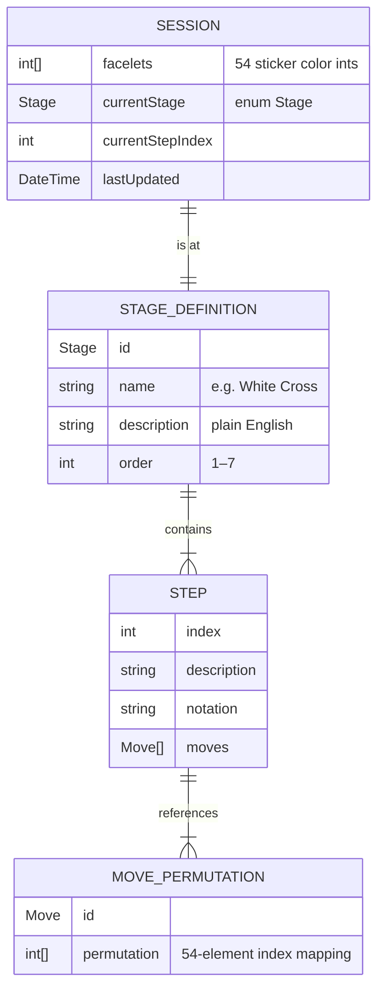

# 05 — Backend Schema
> Rubik's Cube Learning App · v1.0 · Last updated: 2026-10-02
> Note: v1 is fully local — no server, no network. "Backend" here means the
> on-device data model, domain logic contracts, and local storage schema.

---

## 1. Data Model

### 1a. Core Types

```dart
// ─── Cube State ───────────────────────────────────────────────
// 54 integers, one per sticker.
// Index layout: U(0-8), R(9-17), F(18-26), D(27-35), L(36-44), B(45-53)
// Within each face block, cells are numbered left-to-right, top-to-bottom:
//   0 1 2
//   3 4 5
//   6 7 8
// Center of face X is always facelets[X * 9 + 4].
typedef Facelets = List<int>; // length == 54, values 0–5

// Color encoding
enum CubeColor { white, yellow, green, blue, red, orange }
// Index matches int value: white=0, yellow=1, green=2, blue=3, red=4, orange=5

// ─── Move ─────────────────────────────────────────────────────
enum Move { U, Ui, U2, D, Di, D2, R, Ri, R2, L, Li, L2, F, Fi, F2, B, Bi, B2 }
// i suffix = inverse (counter-clockwise); 2 = 180°

// ─── Stage ────────────────────────────────────────────────────
enum Stage {
  whiteCross,       // stage 1
  whiteCorners,     // stage 2
  middleEdges,      // stage 3
  yellowCross,      // stage 4
  orientCorners,    // stage 5
  permuteCorners,   // stage 6
  permuteEdges,     // stage 7
}

// ─── Step ─────────────────────────────────────────────────────
class Step {
  final String description;     // plain English instruction
  final List<Move> moves;       // move sequence to animate + apply
  final String notation;        // human-readable: "R U Ri U"
}

// ─── Session ──────────────────────────────────────────────────
class Session {
  final Facelets facelets;      // current cube state (54 ints)
  final Stage currentStage;
  final int currentStepIndex;   // 0-based index into the step list
  final DateTime lastUpdated;
}
```

---

### 1b. Piece View (derived, not stored)

```dart
// Derived read-only views — never persisted, computed on demand.

class CornerPiece {
  final int position;     // 0–7, solved position this corner should occupy
  final int orientation;  // 0=correct, 1=clockwise twist, 2=anti-clockwise twist
}

class EdgePiece {
  final int position;     // 0–11
  final int orientation;  // 0=correct, 1=flipped
}

class PieceView {
  final List<CornerPiece> corners; // length 8
  final List<EdgePiece> edges;     // length 12

  // Factory — derives from facelet array. O(1), pure.
  static PieceView from(Facelets facelets) { ... }
}
```

**Corner position index (standard):**
```
0=URF  1=ULF  2=ULB  3=URB
4=DRF  5=DLF  6=DLB  7=DRB
```

**Edge position index (standard):**
```
0=UR  1=UF  2=UL  3=UB
4=DR  5=DF  6=DL  7=DB
8=FR  9=FL  10=BL  11=BR
```

---

## 2. Entity Relationship Diagram



> All `STAGE_DEFINITION`, `STEP`, and `MOVE_PERMUTATION` data are **compile-time constants** (hardcoded Dart `const` lists). Only `SESSION` is persisted at runtime.

---

## 3. Local Storage Schema (`shared_preferences`)

All data is stored under a single JSON-encoded key.

| Key | Type | Description |
|-----|------|-------------|
| `session` | `String` (JSON) | Serialized `Session` object. Absent if no session exists. |

### Session JSON shape

```json
{
  "facelets": [0,0,0,0,0,0,0,0,0, 4,4,4,4,4,4,4,4,4, ...],
  "currentStage": "middleEdges",
  "currentStepIndex": 2,
  "lastUpdated": "2026-10-02T22:00:00.000Z"
}
```

- `facelets`: array of 54 integers (0–5)
- `currentStage`: string matching `Stage` enum name
- `currentStepIndex`: 0-based integer
- `lastUpdated`: ISO 8601 string

### Persistence rules
- Written after: every step advance, every step back, every stage transition, every face correction commit.
- Deleted when: user taps "Discard" on Home Screen, or cube is fully solved (Solved Screen reached).
- Read once: at app launch, in `SessionRepository.load()`.

---

## 4. Domain Logic Contracts

### 4a. Validator

```dart
class CubeValidator {
  /// Returns null if valid, or a ValidationError describing the problem.
  static ValidationError? validate(Facelets facelets);
}

class ValidationError {
  final String message;       // human-readable, shown in UI
  final ValidationKind kind;
}

enum ValidationKind {
  wrongColorCount,     // a color appears != 9 times
  twistedCorner,       // corner orientation sum != 0 mod 3
  flippedEdge,         // edge orientation sum != 0 mod 2
  parityError,         // corner perm parity != edge perm parity
}
```

### 4b. Stage Detector

```dart
class StageDetector {
  /// Returns the first incomplete stage (1–7), or null if fully solved.
  static Stage? detect(Facelets facelets);

  /// Returns true if the given stage's completion condition is met.
  static bool isComplete(Facelets facelets, Stage stage);
}
```

Stage completion conditions (evaluated on `PieceView`):

| Stage | Completion condition |
|-------|---------------------|
| `whiteCross` | Edges UR, UF, UL, UB all have position == their solved position AND orientation == 0 |
| `whiteCorners` | All 4 U-layer corners in correct position and orientation == 0 |
| `middleEdges` | Edges FR, FL, BL, BR all in correct position and orientation == 0 |
| `yellowCross` | U-face of edges UR, UF, UL, UB all face Up (orientation == 0) |
| `orientCorners` | All U-face corner facelets are yellow (orientation results in U-face showing yellow) |
| `permuteCorners` | All 4 U-layer corners in correct position (orientation may still be wrong) |
| `permuteEdges` | All 54 facelets match solved state |

### 4c. Move Application

```dart
class MoveApplier {
  /// Returns a new Facelets with the move applied. Pure — does not mutate input.
  static Facelets apply(Facelets facelets, Move move);

  /// Applies a sequence of moves. Pure.
  static Facelets applyAll(Facelets facelets, List<Move> moves);
}
```

Each `Move` maps to a 54-element permutation stored as a compile-time `const List<int>`.

### 4d. Staged Solver

```dart
class StagedSolver {
  /// Returns ordered list of Steps to complete [stage] from [facelets].
  /// Runs in a Dart isolate via compute(). May return empty list if stage
  /// is already complete.
  static Future<List<Step>> solve(Facelets facelets, Stage stage);
}
```

Solver internals per stage (from TRD §5b):

| Stage | Internal method |
|-------|----------------|
| White Cross | BFS over cross-edge reduced state, restricted move set |
| White Corners | Procedural: locate corner → stage below slot → apply trigger |
| Middle Edges | Procedural: locate edge on top → align → apply insert |
| Yellow Cross | Case lookup (4 cases) |
| Orient Corners | Procedural: front-right-top position + sune trigger loop |
| Permute Corners | Case lookup (A-perm variants) |
| Permute Edges | Case lookup (U-perm variants) |

### 4e. Color Classifier

```dart
class ColorClassifier {
  /// Build a classifier calibrated to the 6 center LAB values.
  /// Centers must be provided in order: U, R, F, D, L, B.
  ColorClassifier.fromCenters(List<LabColor> centers);

  /// Classify a single LAB sample to the nearest of the 6 colors.
  CubeColor classify(LabColor sample);
}

class LabColor {
  final double l, a, b;
  double distanceTo(LabColor other); // Euclidean in LAB space
}
```

---

## 5. Data Flow Diagram

```
Camera Image (YUV420)
        │
        ▼
ImageConverter.toRgb()          [image package]
        │
        ▼
PatchSampler.sample9(face)      [center 20% of each cell]
        │
        ▼
RgbToLab.convert()              [pure Dart]
        │
        ▼
ColorClassifier.classify()      [nearest-center LAB]
        │
        ▼
Facelets[face * 9 .. +9]        [9 ints added to array]
        │  (repeated 6×)
        ▼
CubeValidator.validate()        [ValidationError or null]
        │
        ▼
StageDetector.detect()          [Stage enum]
        │
        ▼
StagedSolver.solve()            [List<Step>]  ← runs in isolate
        │
        ▼
SessionRepository.save()        [shared_preferences]
        │
        ▼
TeachingProvider (state)        [drives UI]
```

---

## 6. Validation Rules Summary

| Rule | Check | Error kind |
|------|-------|------------|
| 54 stickers total | `facelets.length == 54` | — (defensive, not user-facing) |
| 9 of each color | Count each value 0–5, all must equal 9 | `wrongColorCount` |
| Corner orientation sum | Sum of all 8 corner orientations % 3 == 0 | `twistedCorner` |
| Edge orientation sum | Sum of all 12 edge orientations % 2 == 0 | `flippedEdge` |
| Permutation parity | Corner permutation parity == edge permutation parity | `parityError` |
